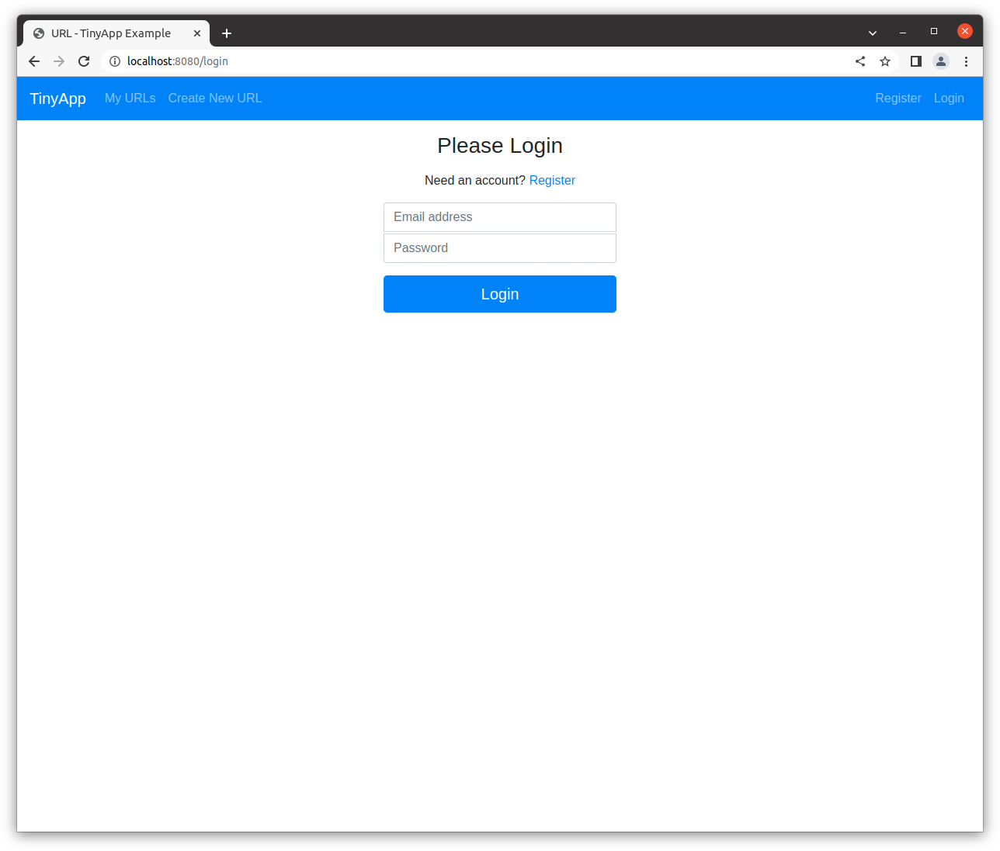
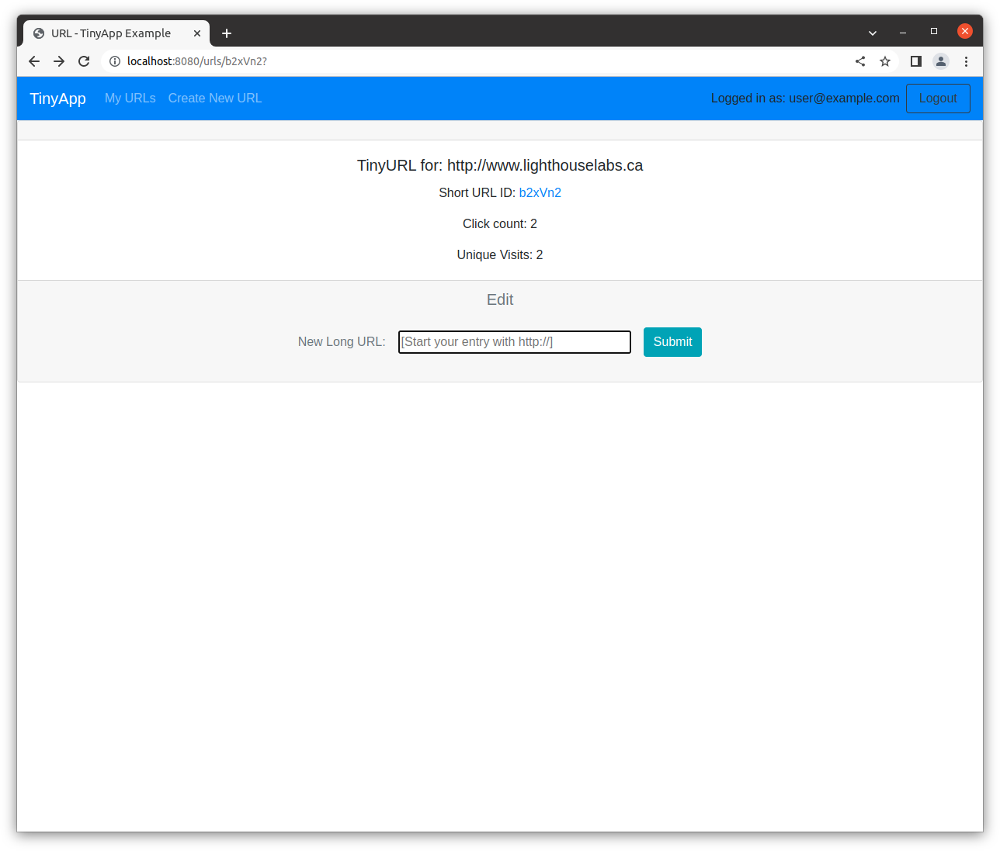
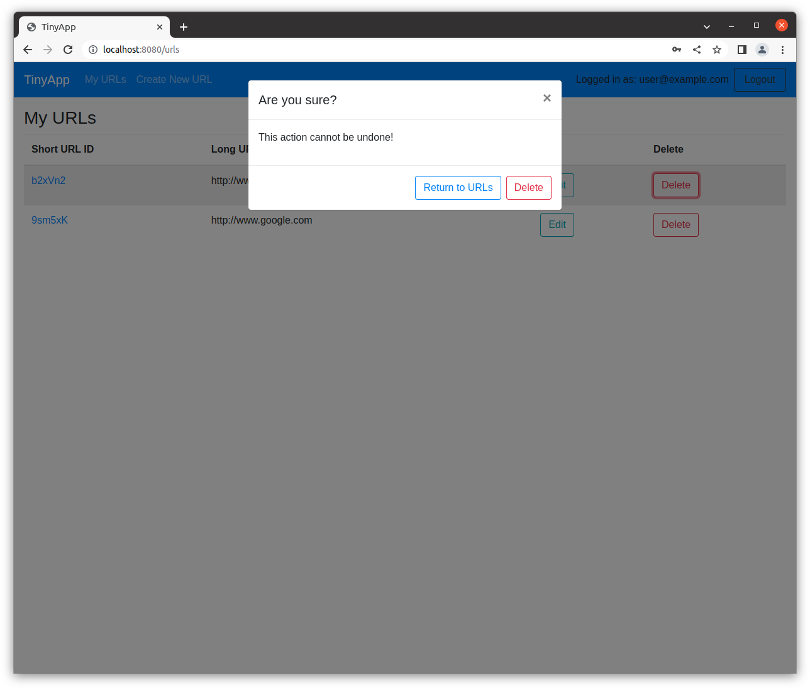

## TinyApp

- This web app will allow users to shorten long URLs much like TinyURL.com and bit.ly do.

### Goals
- Build a simple multipage web app:
  - [x] authentication protection
  - [x] reacts to a users logged in state
  - [x] allows for CRUD operations

### Quick Start:
1. clone and download the GitHub repo and setup dependencies with ```npm install```
2. Navigate to /confirm the repo directory in your terminal. ```cd...```
3. start the TinyApp server in your terminal ```node express_server.js```
4. browse to ```localhost:8080/``` in any browser to get started.

#### NOTE:
- it may be useful to install morgan for code review purposes, if so you will need to uncomment the 'require' and 'use'

### Features:
- [x] **stretch**: show total clicks on a tinyURL in edit page
- [x] **stretch**: show _unique_ clicks on a tinyURL
### Future Goals
- [ ] **stretch**: show _log_ including timestamp, visits, etc 
- [ ] add a userDB and urlDB file logging through the ```fs module```
- [ ] add error handling and validating for url entries and duplicate entries
- [ ] accessibility considerations need to be addressed
- [ ] Create footers

### Views:
- on loading the app you will need to register or login:

- You can edit each longURL and view the click count:

- please be certain you want to delete!



#### Dependencies
- bcryptjs
- chalk
- cookie-parser
- cookie-session
- ejs
- express 
- figlet
- method-override
#### DevDependencies
- chai
- mocha
- morgan
- nodemon


